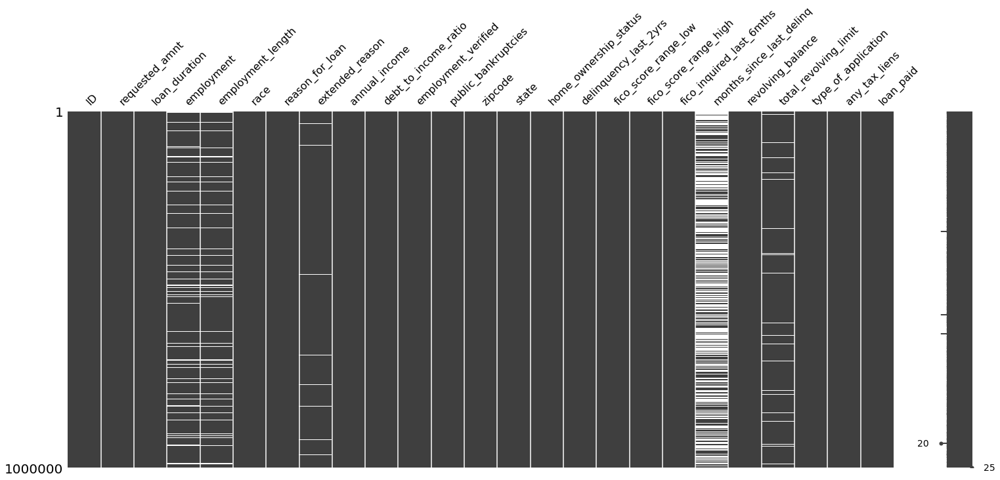

```python
import pandas as pd
import numpy as np
import matplotlib.pyplot as plt
import seaborn as sns
import missingno as msno

```


```python
from sklearn.preprocessing import StandardScaler
```


```python
df = pd.read_csv("lending_train.csv"); val = "train"
# df = pd.read_csv("lending_topredict.csv"); val = "test"
df.head()
```


<div>
<style scoped>
    .dataframe tbody tr th:only-of-type {
        vertical-align: middle;
    }

    .dataframe tbody tr th {
        vertical-align: top;
    }

    .dataframe thead th {
        text-align: right;
    }
</style>
<table border="1" class="dataframe">
  <thead>
    <tr style="text-align: right;">
      <th></th>
      <th>ID</th>
      <th>requested_amnt</th>
      <th>loan_duration</th>
      <th>employment</th>
      <th>employment_length</th>
      <th>race</th>
      <th>reason_for_loan</th>
      <th>extended_reason</th>
      <th>annual_income</th>
      <th>debt_to_income_ratio</th>
      <th>...</th>
      <th>delinquency_last_2yrs</th>
      <th>fico_score_range_low</th>
      <th>fico_score_range_high</th>
      <th>fico_inquired_last_6mths</th>
      <th>months_since_last_delinq</th>
      <th>revolving_balance</th>
      <th>total_revolving_limit</th>
      <th>type_of_application</th>
      <th>any_tax_liens</th>
      <th>loan_paid</th>
    </tr>
  </thead>
  <tbody>
    <tr>
      <th>0</th>
      <td>0</td>
      <td>32000.0</td>
      <td>60 months</td>
      <td>SVP</td>
      <td>4 years</td>
      <td>W</td>
      <td>debt_consolidation</td>
      <td>Debt consolidation</td>
      <td>250000.0</td>
      <td>16.35</td>
      <td>...</td>
      <td>0.0</td>
      <td>775.0</td>
      <td>779.0</td>
      <td>0.0</td>
      <td>NaN</td>
      <td>22480.0</td>
      <td>105700.0</td>
      <td>Individual</td>
      <td>0.0</td>
      <td>1</td>
    </tr>
    <tr>
      <th>1</th>
      <td>1</td>
      <td>6000.0</td>
      <td>36 months</td>
      <td>METAL FABRICATION SUPERVISOR</td>
      <td>10+ years</td>
      <td>B</td>
      <td>home_improvement</td>
      <td>Home improvement</td>
      <td>70000.0</td>
      <td>15.22</td>
      <td>...</td>
      <td>0.0</td>
      <td>650.0</td>
      <td>654.0</td>
      <td>1.0</td>
      <td>30.0</td>
      <td>6313.0</td>
      <td>14600.0</td>
      <td>Individual</td>
      <td>0.0</td>
      <td>1</td>
    </tr>
    <tr>
      <th>2</th>
      <td>2</td>
      <td>4200.0</td>
      <td>36 months</td>
      <td>insurance collector specialist</td>
      <td>10+ years</td>
      <td>W</td>
      <td>debt_consolidation</td>
      <td>Debt consolidation</td>
      <td>37000.0</td>
      <td>20.99</td>
      <td>...</td>
      <td>1.0</td>
      <td>665.0</td>
      <td>669.0</td>
      <td>0.0</td>
      <td>11.0</td>
      <td>4482.0</td>
      <td>10300.0</td>
      <td>Individual</td>
      <td>0.0</td>
      <td>1</td>
    </tr>
    <tr>
      <th>3</th>
      <td>3</td>
      <td>9725.0</td>
      <td>36 months</td>
      <td>Kitchen Manager</td>
      <td>10+ years</td>
      <td>W</td>
      <td>debt_consolidation</td>
      <td>Debt consolidation</td>
      <td>45000.0</td>
      <td>37.76</td>
      <td>...</td>
      <td>0.0</td>
      <td>705.0</td>
      <td>709.0</td>
      <td>0.0</td>
      <td>NaN</td>
      <td>21705.0</td>
      <td>25200.0</td>
      <td>Individual</td>
      <td>0.0</td>
      <td>1</td>
    </tr>
    <tr>
      <th>4</th>
      <td>4</td>
      <td>24000.0</td>
      <td>36 months</td>
      <td>Appeals Specialist</td>
      <td>10+ years</td>
      <td>B</td>
      <td>debt_consolidation</td>
      <td>Debt consolidation</td>
      <td>86000.0</td>
      <td>32.10</td>
      <td>...</td>
      <td>0.0</td>
      <td>650.0</td>
      <td>654.0</td>
      <td>0.0</td>
      <td>76.0</td>
      <td>30406.0</td>
      <td>104200.0</td>
      <td>Individual</td>
      <td>0.0</td>
      <td>1</td>
    </tr>
  </tbody>
</table>
<p>5 rows × 25 columns</p>
</div>


```python
df.shape
```


    (1000000, 25)


```python
msno.matrix(df)
```


    <AxesSubplot:>


    

    


```python
df.isnull().sum(axis = 0)
```


    ID                               0
    requested_amnt                   0
    loan_duration                    0
    employment                   63562
    employment_length            58152
    race                             0
    reason_for_loan                  0
    extended_reason              12425
    annual_income                    0
    debt_to_income_ratio           278
    employment_verified              0
    public_bankruptcies            516
    zipcode                          1
    state                            0
    home_ownership_status            0
    delinquency_last_2yrs            0
    fico_score_range_low             0
    fico_score_range_high            0
    fico_inquired_last_6mths         1
    months_since_last_delinq    504309
    revolving_balance                0
    total_revolving_limit        50231
    type_of_application              0
    any_tax_liens                   28
    loan_paid                        0
    dtype: int64


## Feature Cleaning & Scaling


```python
# columns to keep 
# requested_amnt, loan_duration, employment_length, reason_for_loan, annual_income (requires rounding), debt_to_income_ratio (normalize)
# employment_verified, public_bankruptcies, home_ownership_status,
# 
# delinquency_last_2yrs, fico_score_range_low, fico_score_range_high, fico_inquired_last_6mths, 
# revolving_balance, any_tax_liens

# ADDED TYPE OF APPLICATION as feature
 

# drop employment because of large variation of unique values, ABLE TO GROUP BY KNOWLEDGE
# drop race because its illegal

# drop extended reason, because large variance, ABLE TO GROUP 
# drop zipcode, state
# drop type of application low variance in data

# drop total revolving limit due to many null columns
# drop months_since_last_delinq since too many nans
```


```python
new_df = pd.DataFrame()
```


```python
# print(df["requested_amnt"].nunique())
# print(df["requested_amnt"].isnull().sum())
# df[df["requested_amnt"] > 10_000]["requested_amnt"].count()

new_df["requested_amnt"] = df["requested_amnt"]
new_df.loc[df["requested_amnt"] <= 2_500, "requested_amnt"] = "<_2500"
new_df.loc[df["requested_amnt"] > 2_500, "requested_amnt"] = ">_2500"
new_df.loc[df["requested_amnt"] > 5_000, "requested_amnt"] = ">_5000"
new_df.loc[df["requested_amnt"] > 10_000, "requested_amnt"] = ">_10000"
new_df.loc[df["requested_amnt"] > 20_000, "requested_amnt"] = ">_20000"
new_df.loc[df["requested_amnt"] > 30_000, "requested_amnt"] = ">_30000"

new_df["requested_amnt"].value_counts()

# new_df["requested_amnt"] = df["requested_amnt"]
# scaler = StandardScaler()
# new_df["requested_amnt"] = scaler.fit_transform(df["requested_amnt"].values.reshape(-1, 1))

```


    >_10000    370260
    >_5000     277525
    >_20000    156260
    >_2500     104665
    >_30000     60707
    <_2500      30583
    Name: requested_amnt, dtype: int64


```python
# print(df["employment_length"].nunique())
# print(df["employment_length"].isnull().sum())
# df["employment_length"].value_counts()

new_df["employment_length"] = df["employment_length"]

# condition1 = (df["employment_length"] == "< 1 year") | (df["employment_length"] == "1 year") | (df["employment_length"] == "2 years")
# condition2 = (df["employment_length"] == "3 years") | (df["employment_length"] == "4 years") | (df["employment_length"] == "5 years")
# condition3 = (df["employment_length"] == "6 years") | (df["employment_length"] == "7 years") | (df["employment_length"] == "8 years") | (df["employment_length"] == "9 years")


# new_df.loc[condition1, "employment_length"] = "0-2_years"
# new_df.loc[condition2, "employment_length"] = "3-5_years"
# new_df.loc[condition3, "employment_length"] = "6-9_years"

new_df["employment_length"].value_counts()
```


    10+ years    328732
    2 years       90446
    < 1 year      80348
    3 years       80064
    1 year        65769
    5 years       62699
    4 years       59768
    6 years       46705
    8 years       45256
    7 years       44313
    9 years       37748
    Name: employment_length, dtype: int64


```python
# df["type_of_application"].value_counts()
# df["loan_duration"].value_counts()

new_df["type_of_application"] = df["type_of_application"]
new_df["loan_duration"] = df["loan_duration"]
new_df["state"] = df["state"]
```


```python
# print(df["reason_for_loan"].nunique())
# print(df["reason_for_loan"].isnull().sum())
# df["reason_for_loan"].value_counts()

new_df["reason_for_loan"] = df["reason_for_loan"]
new_df.loc[(new_df["reason_for_loan"] != "debt_consolidation") & (new_df["reason_for_loan"] != "credit_card"), "reason_for_loan"] = "other"

new_df["reason_for_loan"].value_counts()
```


    debt_consolidation    579969
    credit_card           219631
    other                 200400
    Name: reason_for_loan, dtype: int64


```python
# print(df["annual_income"].nunique())
# print(df["annual_income"].isnull().sum())
# df[df["annual_income"] > 50_000]["annual_income"].count()

# new_df["annual_income"] = pd.Series()
# new_df.loc[df["annual_income"] <= 25_000, "annual_income"] = "<_25000"
# new_df.loc[df["annual_income"] > 25_000, "annual_income"] = ">_25000"
# new_df.loc[df["annual_income"] > 50_000, "annual_income"] = ">_50000"
# new_df.loc[df["annual_income"] > 75_000, "annual_income"] = ">_75000"
# new_df.loc[df["annual_income"] > 100_000, "annual_income"] = ">_100000"
# new_df["annual_income"].value_counts()

new_df["annual_income"] = df["annual_income"]
if val == "train":
    scaler1 = StandardScaler()
    new_df["annual_income"] = scaler1.fit_transform(df["annual_income"].values.reshape(-1, 1))
else:
    new_df["annual_income"] = scaler1.transform(new_df["annual_income"].values.reshape(-1, 1))

```


```python
new_df["debt_to_income_ratio"] = df["debt_to_income_ratio"]
new_df['debt_to_income_ratio'] = new_df["debt_to_income_ratio"].fillna(new_df["debt_to_income_ratio"].mean())
if val == "train":
    scaler2 = StandardScaler()
    new_df["debt_to_income_ratio"] = scaler2.fit_transform(new_df["debt_to_income_ratio"].values.reshape(-1, 1))
else:
    new_df["debt_to_income_ratio"] = scaler2.transform(new_df["debt_to_income_ratio"].values.reshape(-1, 1))
```


```python
# print(df["employment_verified"].nunique())
# print(df["employment_verified"].isnull().sum())
# df["employment_verified"].value_counts()

new_df["employment_verified"] = df["employment_verified"]
```


```python
new_df.head()
```


<div>
<style scoped>
    .dataframe tbody tr th:only-of-type {
        vertical-align: middle;
    }

    .dataframe tbody tr th {
        vertical-align: top;
    }

    .dataframe thead th {
        text-align: right;
    }
</style>
<table border="1" class="dataframe">
  <thead>
    <tr style="text-align: right;">
      <th></th>
      <th>requested_amnt</th>
      <th>employment_length</th>
      <th>type_of_application</th>
      <th>loan_duration</th>
      <th>state</th>
      <th>reason_for_loan</th>
      <th>annual_income</th>
      <th>debt_to_income_ratio</th>
      <th>employment_verified</th>
    </tr>
  </thead>
  <tbody>
    <tr>
      <th>0</th>
      <td>&gt;_30000</td>
      <td>4 years</td>
      <td>Individual</td>
      <td>60 months</td>
      <td>FL</td>
      <td>debt_consolidation</td>
      <td>2.459195</td>
      <td>-0.172779</td>
      <td>Verified</td>
    </tr>
    <tr>
      <th>1</th>
      <td>&gt;_5000</td>
      <td>10+ years</td>
      <td>Individual</td>
      <td>36 months</td>
      <td>AR</td>
      <td>other</td>
      <td>-0.088885</td>
      <td>-0.274133</td>
      <td>Source Verified</td>
    </tr>
    <tr>
      <th>2</th>
      <td>&gt;_2500</td>
      <td>10+ years</td>
      <td>Individual</td>
      <td>36 months</td>
      <td>NY</td>
      <td>debt_consolidation</td>
      <td>-0.556033</td>
      <td>0.243401</td>
      <td>Not Verified</td>
    </tr>
    <tr>
      <th>3</th>
      <td>&gt;_5000</td>
      <td>10+ years</td>
      <td>Individual</td>
      <td>36 months</td>
      <td>MI</td>
      <td>debt_consolidation</td>
      <td>-0.442785</td>
      <td>1.747567</td>
      <td>Source Verified</td>
    </tr>
    <tr>
      <th>4</th>
      <td>&gt;_20000</td>
      <td>10+ years</td>
      <td>Individual</td>
      <td>36 months</td>
      <td>MN</td>
      <td>debt_consolidation</td>
      <td>0.137611</td>
      <td>1.239899</td>
      <td>Not Verified</td>
    </tr>
  </tbody>
</table>
</div>


```python
# print(df["public_bankruptcies"].nunique())
# print(df["public_bankruptcies"].isnull().sum())
# df["public_bankruptcies"].value_counts()

new_df["public_bankruptcies"] = df["public_bankruptcies"]
new_df['public_bankruptcies'] = new_df["public_bankruptcies"].fillna(0)

new_df.loc[new_df["public_bankruptcies"] == 0, "public_bankruptcies"] = "==0"
new_df.loc[df["public_bankruptcies"] == 1, "public_bankruptcies"] = "==1"
new_df.loc[df["public_bankruptcies"] >= 2, "public_bankruptcies"] = ">=2"

new_df["public_bankruptcies"].value_counts()

# scaler = StandardScaler()
# new_df["public_bankruptcies"] = scaler.fit_transform(new_df["public_bankruptcies"].values.reshape(-1, 1))
```


    ==0    875283
    ==1    117330
    >=2      7387
    Name: public_bankruptcies, dtype: int64


```python
# print(df["home_ownership_status"].unique())
# print(df["home_ownership_status"].isnull().sum())
# df["home_ownership_status"].value_counts()

new_df["home_ownership_status"] = df["home_ownership_status"]
new_df.loc[df["home_ownership_status"] == "ANY", "home_ownership_status"] = "OTHER"
new_df.loc[df["home_ownership_status"] == "NONE", "home_ownership_status"] = "OTHER"
new_df.loc[new_df["home_ownership_status"] == "OTHER", "home_ownership_status"] = "OWN"

new_df["home_ownership_status"].value_counts()
```


    MORTGAGE    494869
    RENT        397016
    OWN         108115
    Name: home_ownership_status, dtype: int64


```python
# print(df["delinquency_last_2yrs"].nunique())
# print(df["delinquency_last_2yrs"].isnull().sum())
# df["delinquency_last_2yrs"].value_counts()

# new_df["delinquency_last_2yrs"] = pd.Series()
# new_df.loc[df["delinquency_last_2yrs"] == 0, "delinquency_last_2yrs"] = "==0"
# new_df.loc[df["delinquency_last_2yrs"] == 1, "delinquency_last_2yrs"] = "==1"
# new_df.loc[df["delinquency_last_2yrs"] >= 2, "delinquency_last_2yrs"] = ">=2"

# new_df["delinquency_last_2yrs"].value_counts()

new_df["delinquency_last_2yrs"] = df["delinquency_last_2yrs"]
if val == "train":
    scaler3 = StandardScaler()
    new_df["delinquency_last_2yrs"] = scaler3.fit_transform(df["delinquency_last_2yrs"].values.reshape(-1, 1))
else:
    new_df["delinquency_last_2yrs"] = scaler3.transform(df["delinquency_last_2yrs"].values.reshape(-1, 1))
```


```python
# print(df["fico_score_range_low"].nunique())
# print(df["fico_score_range_low"].isnull().sum())
# df["fico_score_range_low"].value_counts()

new_df["fico_score_range_low"] = df["fico_score_range_low"]
if val == "train":
    scaler4 = StandardScaler()
    new_df["fico_score_range_low"] = scaler4.fit_transform(df["fico_score_range_low"].values.reshape(-1, 1))
else:
    new_df["fico_score_range_low"] = scaler4.transform(df["fico_score_range_low"].values.reshape(-1, 1))
```


```python
# print(df["fico_score_range_low"].nunique())
# print(df["fico_score_range_low"].isnull().sum())
# df["fico_score_range_low"].value_counts()
```


```python
# print(df["fico_score_range_high"].nunique())
# print(df["fico_score_range_high"].isnull().sum())
# df["fico_score_range_high"].value_counts()

# # new_df["fico_score_range_high"] = df["fico_score_range_high"]
# # if val == "train":
# #     scaler5 = StandardScaler()
# #     new_df["fico_score_range_high"] = scaler5.fit_transform(df["fico_score_range_high"].values.reshape(-1, 1))
# # else:
#     new_df["fico_score_range_high"] = scaler5.transform(df["fico_score_range_high"].values.reshape(-1, 1))
```


```python
# print(df["fico_inquired_last_6mths"].nunique())
# print(df["fico_inquired_last_6mths"].isnull().sum())
# df["fico_inquired_last_6mths"].value_counts()

new_df["fico_inquired_last_6mths"] = df["fico_inquired_last_6mths"]
new_df['fico_inquired_last_6mths'] = new_df["fico_inquired_last_6mths"].fillna(0)
```


```python
new_df.head()
```


<div>
<style scoped>
    .dataframe tbody tr th:only-of-type {
        vertical-align: middle;
    }

    .dataframe tbody tr th {
        vertical-align: top;
    }

    .dataframe thead th {
        text-align: right;
    }
</style>
<table border="1" class="dataframe">
  <thead>
    <tr style="text-align: right;">
      <th></th>
      <th>requested_amnt</th>
      <th>employment_length</th>
      <th>type_of_application</th>
      <th>loan_duration</th>
      <th>state</th>
      <th>reason_for_loan</th>
      <th>annual_income</th>
      <th>debt_to_income_ratio</th>
      <th>employment_verified</th>
      <th>public_bankruptcies</th>
      <th>home_ownership_status</th>
      <th>delinquency_last_2yrs</th>
      <th>fico_score_range_low</th>
      <th>fico_inquired_last_6mths</th>
    </tr>
  </thead>
  <tbody>
    <tr>
      <th>0</th>
      <td>&gt;_30000</td>
      <td>4 years</td>
      <td>Individual</td>
      <td>60 months</td>
      <td>FL</td>
      <td>debt_consolidation</td>
      <td>2.459195</td>
      <td>-0.172779</td>
      <td>Verified</td>
      <td>==0</td>
      <td>RENT</td>
      <td>-0.361806</td>
      <td>2.540472</td>
      <td>0.0</td>
    </tr>
    <tr>
      <th>1</th>
      <td>&gt;_5000</td>
      <td>10+ years</td>
      <td>Individual</td>
      <td>36 months</td>
      <td>AR</td>
      <td>other</td>
      <td>-0.088885</td>
      <td>-0.274133</td>
      <td>Source Verified</td>
      <td>==0</td>
      <td>MORTGAGE</td>
      <td>-0.361806</td>
      <td>-1.194332</td>
      <td>1.0</td>
    </tr>
    <tr>
      <th>2</th>
      <td>&gt;_2500</td>
      <td>10+ years</td>
      <td>Individual</td>
      <td>36 months</td>
      <td>NY</td>
      <td>debt_consolidation</td>
      <td>-0.556033</td>
      <td>0.243401</td>
      <td>Not Verified</td>
      <td>==0</td>
      <td>OWN</td>
      <td>0.774223</td>
      <td>-0.746156</td>
      <td>0.0</td>
    </tr>
    <tr>
      <th>3</th>
      <td>&gt;_5000</td>
      <td>10+ years</td>
      <td>Individual</td>
      <td>36 months</td>
      <td>MI</td>
      <td>debt_consolidation</td>
      <td>-0.442785</td>
      <td>1.747567</td>
      <td>Source Verified</td>
      <td>==0</td>
      <td>OWN</td>
      <td>-0.361806</td>
      <td>0.448982</td>
      <td>0.0</td>
    </tr>
    <tr>
      <th>4</th>
      <td>&gt;_20000</td>
      <td>10+ years</td>
      <td>Individual</td>
      <td>36 months</td>
      <td>MN</td>
      <td>debt_consolidation</td>
      <td>0.137611</td>
      <td>1.239899</td>
      <td>Not Verified</td>
      <td>==0</td>
      <td>MORTGAGE</td>
      <td>-0.361806</td>
      <td>-1.194332</td>
      <td>0.0</td>
    </tr>
  </tbody>
</table>
</div>


```python
# print(df["revolving_balance"].nunique())
# print(df["revolving_balance"].isnull().sum())
# df[df["revolving_balance"] > 5_000]["revolving_balance"].count()

# new_df["revolving_balance"] = pd.Series()
# new_df.loc[df["revolving_balance"] <= 2_500, "revolving_balance"] = "<_2500"
# new_df.loc[df["revolving_balance"] > 2_500, "revolving_balance"] = ">_2500"
# new_df.loc[df["revolving_balance"] > 5_000, "revolving_balance"] = ">_5000"
# new_df.loc[df["revolving_balance"] > 10_000, "revolving_balance"] = ">_10000"
# new_df.loc[df["revolving_balance"] > 20_000, "revolving_balance"] = ">_20000"

# new_df["revolving_balance"].value_counts()

new_df["revolving_balance"] = df["revolving_balance"]
if val == "train":
    scaler6 = StandardScaler()
    new_df["revolving_balance"] = scaler6.fit_transform(df["revolving_balance"].values.reshape(-1, 1))
else:
    new_df["revolving_balance"] = scaler6.transform(df["revolving_balance"].values.reshape(-1, 1))
```


```python
# any tax liens

# print(df["any_tax_liens"].nunique())
# print(df["any_tax_liens"].isnull().sum())
# df[df["any_tax_liens"]> 0]["any_tax_liens"].count()

new_df["any_tax_liens"] = df["any_tax_liens"]
new_df.loc[new_df["any_tax_liens"] > 0, "any_tax_liens"] = 1
new_df['any_tax_liens'] = new_df["any_tax_liens"].fillna(0)
```


```python
# new_df.to_csv("parsed_df.csv")
```

## Feature Transformation

### One Hot Encoding


```python
y_label = df["loan_paid"]
one_hot_encode = new_df.loc[:, new_df.dtypes == 'object']
non_one_hot_encode = new_df.loc[:, new_df.dtypes != 'object']

one_hot_encode = pd.get_dummies(one_hot_encode, drop_first=False)
one_hot_encode
```


<div>
<style scoped>
    .dataframe tbody tr th:only-of-type {
        vertical-align: middle;
    }

    .dataframe tbody tr th {
        vertical-align: top;
    }

    .dataframe thead th {
        text-align: right;
    }
</style>
<table border="1" class="dataframe">
  <thead>
    <tr style="text-align: right;">
      <th></th>
      <th>requested_amnt_&lt;_2500</th>
      <th>requested_amnt_&gt;_10000</th>
      <th>requested_amnt_&gt;_20000</th>
      <th>requested_amnt_&gt;_2500</th>
      <th>requested_amnt_&gt;_30000</th>
      <th>requested_amnt_&gt;_5000</th>
      <th>employment_length_1 year</th>
      <th>employment_length_10+ years</th>
      <th>employment_length_2 years</th>
      <th>employment_length_3 years</th>
      <th>...</th>
      <th>reason_for_loan_other</th>
      <th>employment_verified_Not Verified</th>
      <th>employment_verified_Source Verified</th>
      <th>employment_verified_Verified</th>
      <th>public_bankruptcies_==0</th>
      <th>public_bankruptcies_==1</th>
      <th>public_bankruptcies_&gt;=2</th>
      <th>home_ownership_status_MORTGAGE</th>
      <th>home_ownership_status_OWN</th>
      <th>home_ownership_status_RENT</th>
    </tr>
  </thead>
  <tbody>
    <tr>
      <th>0</th>
      <td>0</td>
      <td>0</td>
      <td>0</td>
      <td>0</td>
      <td>1</td>
      <td>0</td>
      <td>0</td>
      <td>0</td>
      <td>0</td>
      <td>0</td>
      <td>...</td>
      <td>0</td>
      <td>0</td>
      <td>0</td>
      <td>1</td>
      <td>1</td>
      <td>0</td>
      <td>0</td>
      <td>0</td>
      <td>0</td>
      <td>1</td>
    </tr>
    <tr>
      <th>1</th>
      <td>0</td>
      <td>0</td>
      <td>0</td>
      <td>0</td>
      <td>0</td>
      <td>1</td>
      <td>0</td>
      <td>1</td>
      <td>0</td>
      <td>0</td>
      <td>...</td>
      <td>1</td>
      <td>0</td>
      <td>1</td>
      <td>0</td>
      <td>1</td>
      <td>0</td>
      <td>0</td>
      <td>1</td>
      <td>0</td>
      <td>0</td>
    </tr>
    <tr>
      <th>2</th>
      <td>0</td>
      <td>0</td>
      <td>0</td>
      <td>1</td>
      <td>0</td>
      <td>0</td>
      <td>0</td>
      <td>1</td>
      <td>0</td>
      <td>0</td>
      <td>...</td>
      <td>0</td>
      <td>1</td>
      <td>0</td>
      <td>0</td>
      <td>1</td>
      <td>0</td>
      <td>0</td>
      <td>0</td>
      <td>1</td>
      <td>0</td>
    </tr>
    <tr>
      <th>3</th>
      <td>0</td>
      <td>0</td>
      <td>0</td>
      <td>0</td>
      <td>0</td>
      <td>1</td>
      <td>0</td>
      <td>1</td>
      <td>0</td>
      <td>0</td>
      <td>...</td>
      <td>0</td>
      <td>0</td>
      <td>1</td>
      <td>0</td>
      <td>1</td>
      <td>0</td>
      <td>0</td>
      <td>0</td>
      <td>1</td>
      <td>0</td>
    </tr>
    <tr>
      <th>4</th>
      <td>0</td>
      <td>0</td>
      <td>1</td>
      <td>0</td>
      <td>0</td>
      <td>0</td>
      <td>0</td>
      <td>1</td>
      <td>0</td>
      <td>0</td>
      <td>...</td>
      <td>0</td>
      <td>1</td>
      <td>0</td>
      <td>0</td>
      <td>1</td>
      <td>0</td>
      <td>0</td>
      <td>1</td>
      <td>0</td>
      <td>0</td>
    </tr>
    <tr>
      <th>...</th>
      <td>...</td>
      <td>...</td>
      <td>...</td>
      <td>...</td>
      <td>...</td>
      <td>...</td>
      <td>...</td>
      <td>...</td>
      <td>...</td>
      <td>...</td>
      <td>...</td>
      <td>...</td>
      <td>...</td>
      <td>...</td>
      <td>...</td>
      <td>...</td>
      <td>...</td>
      <td>...</td>
      <td>...</td>
      <td>...</td>
      <td>...</td>
    </tr>
    <tr>
      <th>999995</th>
      <td>0</td>
      <td>0</td>
      <td>0</td>
      <td>0</td>
      <td>0</td>
      <td>1</td>
      <td>0</td>
      <td>0</td>
      <td>1</td>
      <td>0</td>
      <td>...</td>
      <td>1</td>
      <td>0</td>
      <td>0</td>
      <td>1</td>
      <td>0</td>
      <td>1</td>
      <td>0</td>
      <td>1</td>
      <td>0</td>
      <td>0</td>
    </tr>
    <tr>
      <th>999996</th>
      <td>0</td>
      <td>0</td>
      <td>0</td>
      <td>1</td>
      <td>0</td>
      <td>0</td>
      <td>0</td>
      <td>0</td>
      <td>0</td>
      <td>0</td>
      <td>...</td>
      <td>0</td>
      <td>0</td>
      <td>0</td>
      <td>1</td>
      <td>1</td>
      <td>0</td>
      <td>0</td>
      <td>0</td>
      <td>0</td>
      <td>1</td>
    </tr>
    <tr>
      <th>999997</th>
      <td>0</td>
      <td>1</td>
      <td>0</td>
      <td>0</td>
      <td>0</td>
      <td>0</td>
      <td>0</td>
      <td>0</td>
      <td>0</td>
      <td>0</td>
      <td>...</td>
      <td>0</td>
      <td>0</td>
      <td>0</td>
      <td>1</td>
      <td>1</td>
      <td>0</td>
      <td>0</td>
      <td>1</td>
      <td>0</td>
      <td>0</td>
    </tr>
    <tr>
      <th>999998</th>
      <td>0</td>
      <td>1</td>
      <td>0</td>
      <td>0</td>
      <td>0</td>
      <td>0</td>
      <td>1</td>
      <td>0</td>
      <td>0</td>
      <td>0</td>
      <td>...</td>
      <td>0</td>
      <td>1</td>
      <td>0</td>
      <td>0</td>
      <td>1</td>
      <td>0</td>
      <td>0</td>
      <td>0</td>
      <td>0</td>
      <td>1</td>
    </tr>
    <tr>
      <th>999999</th>
      <td>0</td>
      <td>1</td>
      <td>0</td>
      <td>0</td>
      <td>0</td>
      <td>0</td>
      <td>0</td>
      <td>0</td>
      <td>0</td>
      <td>1</td>
      <td>...</td>
      <td>0</td>
      <td>0</td>
      <td>1</td>
      <td>0</td>
      <td>1</td>
      <td>0</td>
      <td>0</td>
      <td>1</td>
      <td>0</td>
      <td>0</td>
    </tr>
  </tbody>
</table>
<p>1000000 rows × 84 columns</p>
</div>


```python
final_df = pd.concat([one_hot_encode, non_one_hot_encode], ignore_index=True, sort=False, axis=1)
final_df.columns = np.concatenate([one_hot_encode.columns, non_one_hot_encode.columns])
final_df
```


<div>
<style scoped>
    .dataframe tbody tr th:only-of-type {
        vertical-align: middle;
    }

    .dataframe tbody tr th {
        vertical-align: top;
    }

    .dataframe thead th {
        text-align: right;
    }
</style>
<table border="1" class="dataframe">
  <thead>
    <tr style="text-align: right;">
      <th></th>
      <th>requested_amnt_&lt;_2500</th>
      <th>requested_amnt_&gt;_10000</th>
      <th>requested_amnt_&gt;_20000</th>
      <th>requested_amnt_&gt;_2500</th>
      <th>requested_amnt_&gt;_30000</th>
      <th>requested_amnt_&gt;_5000</th>
      <th>employment_length_1 year</th>
      <th>employment_length_10+ years</th>
      <th>employment_length_2 years</th>
      <th>employment_length_3 years</th>
      <th>...</th>
      <th>home_ownership_status_MORTGAGE</th>
      <th>home_ownership_status_OWN</th>
      <th>home_ownership_status_RENT</th>
      <th>annual_income</th>
      <th>debt_to_income_ratio</th>
      <th>delinquency_last_2yrs</th>
      <th>fico_score_range_low</th>
      <th>fico_inquired_last_6mths</th>
      <th>revolving_balance</th>
      <th>any_tax_liens</th>
    </tr>
  </thead>
  <tbody>
    <tr>
      <th>0</th>
      <td>0</td>
      <td>0</td>
      <td>0</td>
      <td>0</td>
      <td>1</td>
      <td>0</td>
      <td>0</td>
      <td>0</td>
      <td>0</td>
      <td>0</td>
      <td>...</td>
      <td>0</td>
      <td>0</td>
      <td>1</td>
      <td>2.459195</td>
      <td>-0.172779</td>
      <td>-0.361806</td>
      <td>2.540472</td>
      <td>0.0</td>
      <td>0.276568</td>
      <td>0.0</td>
    </tr>
    <tr>
      <th>1</th>
      <td>0</td>
      <td>0</td>
      <td>0</td>
      <td>0</td>
      <td>0</td>
      <td>1</td>
      <td>0</td>
      <td>1</td>
      <td>0</td>
      <td>0</td>
      <td>...</td>
      <td>1</td>
      <td>0</td>
      <td>0</td>
      <td>-0.088885</td>
      <td>-0.274133</td>
      <td>-0.361806</td>
      <td>-1.194332</td>
      <td>1.0</td>
      <td>-0.441405</td>
      <td>0.0</td>
    </tr>
    <tr>
      <th>2</th>
      <td>0</td>
      <td>0</td>
      <td>0</td>
      <td>1</td>
      <td>0</td>
      <td>0</td>
      <td>0</td>
      <td>1</td>
      <td>0</td>
      <td>0</td>
      <td>...</td>
      <td>0</td>
      <td>1</td>
      <td>0</td>
      <td>-0.556033</td>
      <td>0.243401</td>
      <td>0.774223</td>
      <td>-0.746156</td>
      <td>0.0</td>
      <td>-0.522719</td>
      <td>0.0</td>
    </tr>
    <tr>
      <th>3</th>
      <td>0</td>
      <td>0</td>
      <td>0</td>
      <td>0</td>
      <td>0</td>
      <td>1</td>
      <td>0</td>
      <td>1</td>
      <td>0</td>
      <td>0</td>
      <td>...</td>
      <td>0</td>
      <td>1</td>
      <td>0</td>
      <td>-0.442785</td>
      <td>1.747567</td>
      <td>-0.361806</td>
      <td>0.448982</td>
      <td>0.0</td>
      <td>0.242150</td>
      <td>0.0</td>
    </tr>
    <tr>
      <th>4</th>
      <td>0</td>
      <td>0</td>
      <td>1</td>
      <td>0</td>
      <td>0</td>
      <td>0</td>
      <td>0</td>
      <td>1</td>
      <td>0</td>
      <td>0</td>
      <td>...</td>
      <td>1</td>
      <td>0</td>
      <td>0</td>
      <td>0.137611</td>
      <td>1.239899</td>
      <td>-0.361806</td>
      <td>-1.194332</td>
      <td>0.0</td>
      <td>0.628560</td>
      <td>0.0</td>
    </tr>
    <tr>
      <th>...</th>
      <td>...</td>
      <td>...</td>
      <td>...</td>
      <td>...</td>
      <td>...</td>
      <td>...</td>
      <td>...</td>
      <td>...</td>
      <td>...</td>
      <td>...</td>
      <td>...</td>
      <td>...</td>
      <td>...</td>
      <td>...</td>
      <td>...</td>
      <td>...</td>
      <td>...</td>
      <td>...</td>
      <td>...</td>
      <td>...</td>
      <td>...</td>
    </tr>
    <tr>
      <th>999995</th>
      <td>0</td>
      <td>0</td>
      <td>0</td>
      <td>0</td>
      <td>0</td>
      <td>1</td>
      <td>0</td>
      <td>0</td>
      <td>1</td>
      <td>0</td>
      <td>...</td>
      <td>1</td>
      <td>0</td>
      <td>0</td>
      <td>-0.074729</td>
      <td>0.686488</td>
      <td>0.774223</td>
      <td>-0.746156</td>
      <td>2.0</td>
      <td>-0.059481</td>
      <td>0.0</td>
    </tr>
    <tr>
      <th>999996</th>
      <td>0</td>
      <td>0</td>
      <td>0</td>
      <td>1</td>
      <td>0</td>
      <td>0</td>
      <td>0</td>
      <td>0</td>
      <td>0</td>
      <td>0</td>
      <td>...</td>
      <td>0</td>
      <td>0</td>
      <td>1</td>
      <td>-0.541877</td>
      <td>-0.443654</td>
      <td>-0.361806</td>
      <td>-0.148587</td>
      <td>0.0</td>
      <td>-0.508019</td>
      <td>0.0</td>
    </tr>
    <tr>
      <th>999997</th>
      <td>0</td>
      <td>1</td>
      <td>0</td>
      <td>0</td>
      <td>0</td>
      <td>0</td>
      <td>0</td>
      <td>0</td>
      <td>0</td>
      <td>0</td>
      <td>...</td>
      <td>1</td>
      <td>0</td>
      <td>0</td>
      <td>-0.265835</td>
      <td>-0.795254</td>
      <td>-0.361806</td>
      <td>1.046550</td>
      <td>1.0</td>
      <td>-0.240628</td>
      <td>0.0</td>
    </tr>
    <tr>
      <th>999998</th>
      <td>0</td>
      <td>1</td>
      <td>0</td>
      <td>0</td>
      <td>0</td>
      <td>0</td>
      <td>1</td>
      <td>0</td>
      <td>0</td>
      <td>0</td>
      <td>...</td>
      <td>0</td>
      <td>0</td>
      <td>1</td>
      <td>-0.400317</td>
      <td>-0.159325</td>
      <td>-0.361806</td>
      <td>0.000805</td>
      <td>1.0</td>
      <td>-0.022532</td>
      <td>0.0</td>
    </tr>
    <tr>
      <th>999999</th>
      <td>0</td>
      <td>1</td>
      <td>0</td>
      <td>0</td>
      <td>0</td>
      <td>0</td>
      <td>0</td>
      <td>0</td>
      <td>0</td>
      <td>1</td>
      <td>...</td>
      <td>1</td>
      <td>0</td>
      <td>0</td>
      <td>-0.400317</td>
      <td>1.665945</td>
      <td>-0.361806</td>
      <td>-0.297979</td>
      <td>0.0</td>
      <td>0.240596</td>
      <td>0.0</td>
    </tr>
  </tbody>
</table>
<p>1000000 rows × 91 columns</p>
</div>


```python
# from imblearn.over_sampling import RandomOverSampler
# over = RandomOverSampler(random_state=42)

# final_df, y_label = over.fit_resample(final_df, y_label)
```

## Feature selection

### Recursive Feature Elimination (RFE)


```python
if val == "train":
    from sklearn.feature_selection import RFE
    from sklearn.tree import DecisionTreeClassifier
    from sklearn.discriminant_analysis import LinearDiscriminantAnalysis as LDA

    rfe = RFE(estimator=DecisionTreeClassifier(), n_features_to_select=10, verbose=3)
    rfe.fit(final_df, y_label)
```

    Fitting estimator with 91 features.
    Fitting estimator with 90 features.
    Fitting estimator with 89 features.
    Fitting estimator with 88 features.
    Fitting estimator with 87 features.
    Fitting estimator with 86 features.
    Fitting estimator with 85 features.
    Fitting estimator with 84 features.
    Fitting estimator with 83 features.
    Fitting estimator with 82 features.
    Fitting estimator with 81 features.
    Fitting estimator with 80 features.
    Fitting estimator with 79 features.
    Fitting estimator with 78 features.
    Fitting estimator with 77 features.
    Fitting estimator with 76 features.
    Fitting estimator with 75 features.
    Fitting estimator with 74 features.
    Fitting estimator with 73 features.
    Fitting estimator with 72 features.
    Fitting estimator with 71 features.
    Fitting estimator with 70 features.
    Fitting estimator with 69 features.
    Fitting estimator with 68 features.
    Fitting estimator with 67 features.
    Fitting estimator with 66 features.
    Fitting estimator with 65 features.
    Fitting estimator with 64 features.
    Fitting estimator with 63 features.
    Fitting estimator with 62 features.
    Fitting estimator with 61 features.
    Fitting estimator with 60 features.
    Fitting estimator with 59 features.
    Fitting estimator with 58 features.
    Fitting estimator with 57 features.
    Fitting estimator with 56 features.
    Fitting estimator with 55 features.
    Fitting estimator with 54 features.
    Fitting estimator with 53 features.
    Fitting estimator with 52 features.
    Fitting estimator with 51 features.
    Fitting estimator with 50 features.
    Fitting estimator with 49 features.
    Fitting estimator with 48 features.
    Fitting estimator with 47 features.
    Fitting estimator with 46 features.
    Fitting estimator with 45 features.
    Fitting estimator with 44 features.
    Fitting estimator with 43 features.
    Fitting estimator with 42 features.
    Fitting estimator with 41 features.
    Fitting estimator with 40 features.
    Fitting estimator with 39 features.
    Fitting estimator with 38 features.
    Fitting estimator with 37 features.
    Fitting estimator with 36 features.
    Fitting estimator with 35 features.
    Fitting estimator with 34 features.
    Fitting estimator with 33 features.
    Fitting estimator with 32 features.
    Fitting estimator with 31 features.
    Fitting estimator with 30 features.
    Fitting estimator with 29 features.
    Fitting estimator with 28 features.
    Fitting estimator with 27 features.
    Fitting estimator with 26 features.
    Fitting estimator with 25 features.
    Fitting estimator with 24 features.
    Fitting estimator with 23 features.
    Fitting estimator with 22 features.
    Fitting estimator with 21 features.
    Fitting estimator with 20 features.
    Fitting estimator with 19 features.
    Fitting estimator with 18 features.
    Fitting estimator with 17 features.
    Fitting estimator with 16 features.
    Fitting estimator with 15 features.
    Fitting estimator with 14 features.
    Fitting estimator with 13 features.
    Fitting estimator with 12 features.
    Fitting estimator with 11 features.
    


```python
rfe.ranking_
```


    array([55,  2, 17, 25, 47,  6, 12,  1,  3,  9, 15, 14, 16, 19, 18, 23,  7,
           64, 53, 82,  1, 73, 48, 58, 36,  1, 42, 51, 76, 70, 10, 33, 65, 81,
           78, 27, 49, 60, 56, 50, 39, 38, 80, 37, 41, 43, 61, 72, 32, 79, 68,
           69, 24, 63, 45, 13, 29, 54, 59, 28, 67, 57, 74, 44,  5, 62, 34, 77,
           46, 52, 71, 75, 20,  1, 11, 35, 21,  8,  4, 26, 66, 40, 30, 22,  1,
            1,  1,  1,  1,  1, 31])


```python
chosen_feature = rfe.get_feature_names_out(np.concatenate([one_hot_encode.columns, non_one_hot_encode.columns]))
chosen_feature
```


    array(['employment_length_10+ years', 'loan_duration_ 60 months',
           'state_CA', 'reason_for_loan_debt_consolidation', 'annual_income',
           'debt_to_income_ratio', 'delinquency_last_2yrs',
           'fico_score_range_low', 'fico_inquired_last_6mths',
           'revolving_balance'], dtype=object)


```python
# final_df.columns = np.concatenate([one_hot_encode.columns, non_one_hot_encode.columns])
# final_df.loc[:, chosen_feature]
```


```python
# final_df = final_df.loc[:, chosen_feature]
```


```python
if val == "test":
    y_pred = clf8.predict(final_df)
    # y_pred = mlp_nn.predict(final_df)
    final_pred_df = pd.concat([df["ID"], pd.Series(y_pred)], ignore_index=True, sort=False, axis=1)
    final_pred_df.columns = ["ID", "loan_paid"]
    final_pred_df.head()
    final_pred_df.set_index('ID', inplace=True)
    final_pred_df.to_csv("lending_pred_mlp_60_new_fea.csv")
```


```python
if val == "test": raise
```

## Model Selection

### Random Sampling


```python
from imblearn.over_sampling import RandomOverSampler

# under = RandomUnderSampler(sampling_strategy={1: 0.5, 0: 0.5})
# under = RandomUnderSampler(random_state=42)
over = RandomOverSampler(random_state=42)

final_df, y_label = over.fit_resample(final_df, y_label)
# y_label.value_counts()
```


```python
from sklearn.model_selection import GridSearchCV
from sklearn.pipeline import Pipeline
from sklearn.svm import SVC
from sklearn.ensemble import RandomForestClassifier
from sklearn.ensemble import GradientBoostingClassifier
from sklearn.tree import DecisionTreeClassifier
from sklearn.naive_bayes import MultinomialNB
from sklearn.neighbors import KNeighborsClassifier
from sklearn.discriminant_analysis import LinearDiscriminantAnalysis as LDA
from sklearn.neural_network import MLPClassifier

from sklearn.metrics import  precision_recall_curve, roc_auc_score, confusion_matrix, accuracy_score, recall_score, precision_score, f1_score,auc, roc_curve, plot_confusion_matrix

from sklearn.model_selection import train_test_split
from sklearn.metrics import classification_report


clf1 = RandomForestClassifier(random_state=42)
clf2 = SVC(probability=True, random_state=42)
clf4 = DecisionTreeClassifier(random_state=42)
clf5 = KNeighborsClassifier()
clf6 = MultinomialNB()
clf7 = GradientBoostingClassifier(random_state=42)
clf8 = LDA()
mlp_nn = MLPClassifier(solver = 'adam', hidden_layer_sizes=(60,), early_stopping=True, learning_rate_init=0.0007 , random_state = 42, max_iter = 1000) #, verbose = 3)
```


```python
X_train, X_test, y_train, y_test = train_test_split(final_df.values, y_label.values.ravel(), test_size=0.2, random_state=42, stratify=y_label)
```

### Multi Layer Perceptron


```python
mlp_nn.fit(X_train, y_train)
y_pred = mlp_nn.predict(X_test)

print(classification_report(y_pred, y_test))
fpr, tpr, thresholds = roc_curve(y_test,y_pred)
roc_auc = auc(fpr, tpr)
print(roc_auc)

```

                  precision    recall  f1-score   support
    
               0       0.64      0.65      0.64    158030
               1       0.65      0.65      0.65    161918
    
        accuracy                           0.65    319948
       macro avg       0.65      0.65      0.65    319948
    weighted avg       0.65      0.65      0.65    319948
    
    0.6468238588770675
    

### Gradient Boosting


```python
clf7.fit(X_train, y_train)
y_pred = clf7.predict(X_test)

from sklearn.metrics import classification_report
print(classification_report(y_pred, y_test))
```

                  precision    recall  f1-score   support
    
               0       0.63      0.64      0.63    156245
               1       0.65      0.63      0.64    163703
    
        accuracy                           0.64    319948
       macro avg       0.64      0.64      0.64    319948
    weighted avg       0.64      0.64      0.64    319948
    
    

### Linear Discrimnant Analysis


```python
clf8.fit(X_train, y_train)
y_pred = clf8.predict(X_test)

from sklearn.metrics import classification_report
print(classification_report(y_pred, y_test))

fpr, tpr, thresholds = roc_curve(y_test,y_pred)
roc_auc = auc(fpr, tpr)
print(roc_auc)
```

                  precision    recall  f1-score   support
    
               0       0.61      0.64      0.62    153655
               1       0.65      0.63      0.64    166293
    
        accuracy                           0.63    319948
       macro avg       0.63      0.63      0.63    319948
    weighted avg       0.63      0.63      0.63    319948
    
    0.6317995424256443
    

### Cross Validation on LDA


```python
from sklearn.model_selection import cross_val_score
scores = cross_val_score(clf8, X_train, y_train, cv=5, scoring='precision')
print(scores)
```

    [0.62628761 0.62664969 0.62649821 0.62718829 0.62743698]
    


```python
!jupyter nbconvert --to markdown README.ipynb --output README.md
```
